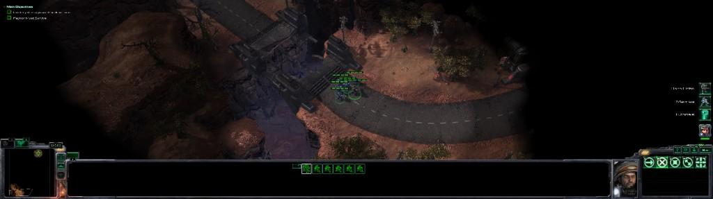

# sc2-ultrawide

StarCraft II limits its view to 16:9. On a wider monitor you get black bars on the sides or a stretched picture. This tool removes that limit while the game is running, so the game fills a 21:9 or 32:9 screen and the camera shows more of the screen. It also stretches the middle of the bottom console so the HUD frame reaches from the minimap to the command card instead of breaking into three pieces.

It is a small Python tool. It switches two internal game settings on for a fraction of a second, resizes the game window, and switches them back. It then leaves a small helper running in the background that changes two numbers on the bottom console each time a mission loads, and stops when you close the game. It does not modify any game files, and closing the game undoes the change.



## Risks and disclaimer

**Read this section before you run anything.**

- This program changes the memory of a running StarCraft II client. Blizzard's terms of use forbid third-party programs that modify the game. **Your Battle.net account can be suspended or banned for it, including when you only play single-player content.** StarCraft II runs anti-cheat checks while you are connected to Battle.net, and nobody outside Blizzard knows exactly what they look for.
- The two settings it switches belong to StarCraft II's built-in client API, the interface Blizzard provides for bots and machine-learning research. While they are on, parts of the game behave as if that API were active. They stay on until the game accepts the new window size, which usually takes well under a second. No side effects showed up in testing, but **a crash is possible. Save before you run it during a mission.**
- `apply` leaves a small helper running in the background until you close StarCraft II. Each time a mission loads, the helper writes two numbers and one flag into the game's memory to stretch the bottom console, so the tool keeps writing into the game over your whole session, not only once.
- A wider view shows more of the map, which is an unfair advantage against other players. The tool does not check what you are playing, and the window stays wide until you run `revert` or restart StarCraft II. **Do one of those before you play any game with other people.**

**Use it at your own risk. I am not responsible if your Battle.net account is suspended or banned, or if the game crashes and you lose progress.**

## Tested resolutions

Tested on StarCraft II 5.0.16 (build 97563), 64-bit client, Windows 11, Direct3D 9 renderer, in Windowed (Fullscreen) mode.

| Resolution | Aspect | Result |
|---|---|---|
| 5120×1440 | 32:9 | Works. Used in campaign missions on a 5120×1440 monitor. |
| 3440×1440 | 21:9 | Works. The game accepted and stored the exact size. |
| 2560×1080 | 21:9 | Works. The game accepted and stored the exact size. |
| 3840×1600 | 24:10 | Works. The game accepted and stored the exact size. |

The 21:9 and 24:10 rows come from forcing the game window to those sizes on the 5120×1440 monitor. A monitor of that size goes through the same code, but nobody has tried one yet.

The bottom console fix was tested at 5120×1440, 3440×1440 and 2560×1080.

## Requirements

- Windows, 64-bit (tested on Windows 11)
- StarCraft II, 64-bit client. The tool finds the memory it needs in the running game, so it does not need updating for new game builds; see [known issues](#known-issues).
- Python 3 (tested with 3.14). The tool uses only the standard library.
- Display Mode set to Windowed (Fullscreen)

## Beginner guide for Windows

This section is for people who have never used Python or a command line. Do the steps in order. If you already have Python, skip to [Usage](#usage).

### Step 1: Install Python

1. Go to [python.org/downloads](https://www.python.org/downloads/) and click the yellow **Download Python 3.x** button. Save the installer file.
2. Open the installer. On the first screen, **tick the box "Add python.exe to PATH"** at the bottom. This is the step people miss, and nothing below works without it.
3. Click **Install Now** and wait for it to finish. Click **Close**.
4. Check that it worked. Press the **Windows key**, type `powershell`, and press Enter. A blue or black window opens. Type this and press Enter:

   ```
   python --version
   ```

   You should see something like `Python 3.14.0`. If Windows says Python was not found or opens the Microsoft Store, close the window and reinstall Python with the "Add python.exe to PATH" box ticked.

### Step 2: Download the script

1. Open the [project page](https://github.com/PKDT-93/sc2-ultrawide).
2. Click the green **Code** button, then **Download ZIP**.
3. Open your Downloads folder, right-click the ZIP file, and choose **Extract All...**, then **Extract**. You now have a normal folder called `sc2-ultrawide-main` that contains `sc2_ultrawide.py` and a folder called `ultrawide`. Keep them together: the script needs that folder next to it.

### Step 3: Set up StarCraft II

1. Start StarCraft II and go to **Options > Graphics**.
2. Set **Display Mode** to **Windowed (Fullscreen)** and apply the change.
3. Go back to the main menu and leave the game running.

### Step 4: Run the script

1. Open the extracted `sc2-ultrawide-main` folder in File Explorer.
2. Click an empty area of the address bar at the top of the window, type `powershell`, and press Enter. A PowerShell window opens already pointed at this folder.
3. Type this and press Enter:

   ```
   python sc2_ultrawide.py apply
   ```

4. The game window stretches to the full width of your monitor. You can close PowerShell now; a small helper keeps the bottom console framed in every mission until you close StarCraft II.
5. Load a campaign mission and play.

If something goes wrong:

| What you see | What to do |
|---|---|
| `'python' is not recognized` or the Microsoft Store opens | Python is not on your PATH. Reinstall it and tick "Add python.exe to PATH". |
| `SC2_x64.exe is not running` or `Game window not found` | Start StarCraft II, wait for the main menu, then run the command again. |
| The script says it could not find the memory it needs | A game patch changed that part of the game. See [known issues](#known-issues). |
| An "access denied" message | Close PowerShell, search for it in the Start menu, right-click it, choose **Run as administrator**, then `cd` into the folder and run the command again. |

### Every time you play

The change only lasts until you close StarCraft II. Each time you start the game, repeat Step 4 (open PowerShell in the folder and run the `apply` command). You do not need to redo Steps 1 to 3.

To go back to the normal 16:9 window, for example before you play against other people, open PowerShell in the same folder and run:

```
python sc2_ultrawide.py revert
```

**Read the [risks and disclaimer](#risks-and-disclaimer) before you use this.**

## Usage

1. In StarCraft II, open Options > Graphics and set Display Mode to Windowed (Fullscreen).
2. Start the game and wait for the main menu.
3. From a terminal in this folder, run:

   ```
   python sc2_ultrawide.py apply
   ```

The window grows to the full width of your monitor, and a background helper stretches the bottom console to fit each time a mission loads. You can close the terminal. Play the campaign as usual.

Two more commands:

```
python sc2_ultrawide.py status    # read-only: build, window size, wide mode, console state
python sc2_ultrawide.py revert    # window back to 16:9, console back to normal
```

The change lasts until StarCraft II closes, so run `apply` again after every launch. Anything that resizes the game window, such as changing display settings, makes the game enforce its 16:9 limit again, and the helper then puts the console back and stops. Run `apply` again if that happens.

## How it works

StarCraft II limits its aspect ratio (width divided by height) to 1366/768, about 1.7786, a single number stored in `SC2_x64.exe`. Three pieces of code read it: one sizes the game window, one sizes the picture in exclusive fullscreen mode, and one filters the resolution list in the Options menu. When the window is wider than that ratio, the game cuts its width to height × 1.7786. On a 5120×1440 monitor that leaves a 2561-pixel-wide window in the middle of the screen.

Finding that number meant working on the running game, because the executable on disk is encrypted and its code exists in plain form only in memory. The first clue was in the settings: `Documents\StarCraft II\Variables.txt` already held `width=5120`, `height=1440` and `displaymode=1`, yet the game still drew at 2561×1440, so the limit had to be inside the game itself. A read-only copy of the running game's memory (made with `OpenProcess` using `PROCESS_QUERY_INFORMATION | PROCESS_VM_READ`, the game module located through a Toolhelp snapshot, its memory pages listed with `VirtualQueryEx` and copied with `ReadProcessMemory`) confirmed the encryption: the code section looks like random data in the file (8.0 bits of entropy per byte, the maximum) but like normal program code in memory. Searching that copy for values near 16/9, then disassembling the code that reads them (turning machine code back into readable instructions), found the 1366/768 value and the three pieces of code that read it.

Changing that number from outside the game is not possible. `VirtualQueryEx` shows the game's code and fixed values are loaded as read-only, with permission to run but never to write. `VirtualProtectEx` refused every request to make them writable (error 87), and `WriteProcessMemory` failed (error 998), so no other program can change them. Editing the file on disk does not help either, because the code in the file is encrypted.

The window-sizing code has an exception, though. Before it measures anything, it checks whether the client API's render mode is active, and if it is, it accepts any window size. Research clients use that mode to ask for arbitrary resolutions. The check reads two settings, `listen` and `gameStateRender`, and both are stored in a part of the game's memory that can be changed. Their names were confirmed by reading them back from memory.

So `sc2_ultrawide.py apply` does the following:

1. Finds both settings in the running game and reads each one back by name, so it stops before writing anything if the game's memory does not look the way it expects.
2. Switches both settings on, resizes the game window to fill the monitor with `SetWindowPos`, and waits until the game has stored the new size.
3. Restores both settings to their original bytes.

From then on the game draws at the full width. The 3D camera shows more of the map from side to side, and the interface lays itself out across the whole screen. The game only checks the size again when the window is resized. Running those same steps at several ultrawide sizes, and taking a screenshot with GDI (`BitBlt`) each time, produced the results in the table above.

### The bottom console

The console at the bottom of the screen is made of three small 3D models: the minimap piece, the unit-info piece and the command-card piece, each drawn by its own full-screen model frame. The game pins the minimap piece to the left edge, the unit-info piece to the center and the command-card piece to the right edge, and it sizes all three by the screen height so they keep their shape. Each side piece ends in a wing that reaches toward the middle, long enough to meet the middle piece at 16:9 and no further. On a wider screen the pieces drift apart and leave gaps.

The helper that `apply` starts stretches the middle piece sideways until it reaches both wings again. Each end goes where it would sit on a 16:9 screen, measured from its own screen edge. The side pieces draw on top of the middle one, so its stretched ends stay hidden under the wings and the joins look the same as at 16:9. The amount comes from the middle model's own size, which the game keeps in memory, so it follows the window width.

Each model has a position and a scale in memory, and its frame has a flag that tells the game to rebuild the model's placement on the next frame. The helper writes a new horizontal scale and position, then sets that flag. The game rebuilds the console from the skin's own values at every mission load, so the helper checks once a second and stretches it again whenever a new console appears. It runs as a separate background Python process with no window, allows only one copy of itself (through a named mutex), and exits when the game closes or the window goes back to 16:9.

These objects were found in the same read-only memory copy. A list of every UI frame in the running game showed that no flat image covered the gaps, which led to the three model frames (`MinimapModel`, `InfopanelModel`, `CommandPanelModel`). Their settings and the code that places each model came from the disassembled game code.

### Finding the addresses on each run

Every memory address the tool writes to moves when Blizzard ships a new build, so none of them are stored in the code. Each run reads the game's code from memory and finds them by recognizing the code that uses them:

- The window-size check, the same code `status` uses to find the aspect limit, reads the engine's stored window size and the display mode in its first few instructions. It also calls a small function that checks the two client-API settings, and each of those settings is read by a one-line function, which gives its address.
- Each setting's owner is then found by name (`listen`, `gameStateRender` and `displaymode`) just before its value, which also confirms the address is right.
- For the console, the game UI pointer is the value the game loads most often right before it reads its console panel. The console panel field is where the game stores the result of looking up `UIContainer/ConsolePanel`, and the middle model frame is recognized by its name, `InfopanelModel`.

If any of these does not match exactly once, the tool stops before writing and names the one it could not find. Finding everything takes about a third of a second.

APIs and tools used:

- Windows process and memory: `OpenProcess`, `CreateToolhelp32Snapshot`, `Module32FirstW`, `VirtualQueryEx`, `ReadProcessMemory`, `VirtualProtectEx` and `WriteProcessMemory` for the two settings, and `WriteProcessMemory` alone for the console.
- Windows window and screen: `EnumWindows`, `GetWindowRect`, `GetClientRect`, `IsWindow`, `MonitorFromWindow`, `GetMonitorInfoW`, `SetWindowPos`, and `BitBlt`.
- StarCraft II's own status service at `http://127.0.0.1:6119/game` and `/ui`, used during research to tell the menu apart from a loaded game. The tool itself does not call it.
- For the disassembly and scanning: `pefile`, `capstone`, and `numpy`. For screenshots during the console research: Windows Graphics Capture, through the `windows-capture` package.

Reading memory never needs write access, so the parts that only read cannot change the game. `apply` opens the game for writing and changes only the two settings. Its helper opens the game for writing only for the moment it stretches the console. `revert` resizes the window and, if the console was stretched, puts it back.

## Known issues
- Exclusive fullscreen is not supported. The Fullscreen display mode has its own 16:9 limit with no exception, so use Windowed (Fullscreen).
- The tool recognizes specific game code to find the memory it needs. If a game patch changes that code, `apply` and `revert` stop before they write anything and name the part they could not find.
- The stretched middle piece of the console looks a little smoother and darker than the pieces beside it, because its texture is spread several times wider.

## Project layout

- `sc2_ultrawide.py`: the commands (`status`, `apply` and `revert`). This is the file you run.
- `ultrawide/game.py`: the game handle. Finds the running StarCraft II process and its window, and resizes the window.
- `ultrawide/memory.py`: reads and writes the game's memory, and finds the addresses the tool needs. It is the only file that holds game-code patterns.
- `ultrawide/ui.py`: the in-game UI. Fits the bottom console, and runs the background helper that fits it again after each mission load.
- `ultrawide/winapi.py`: the Windows API declarations the other files share.

## Credits

Researched and built with Claude Opus 5.5.

## License

MIT for the code in this repository. StarCraft II is a trademark of Blizzard Entertainment. This project is not affiliated with or endorsed by Blizzard, and it contains no Blizzard code or assets.
